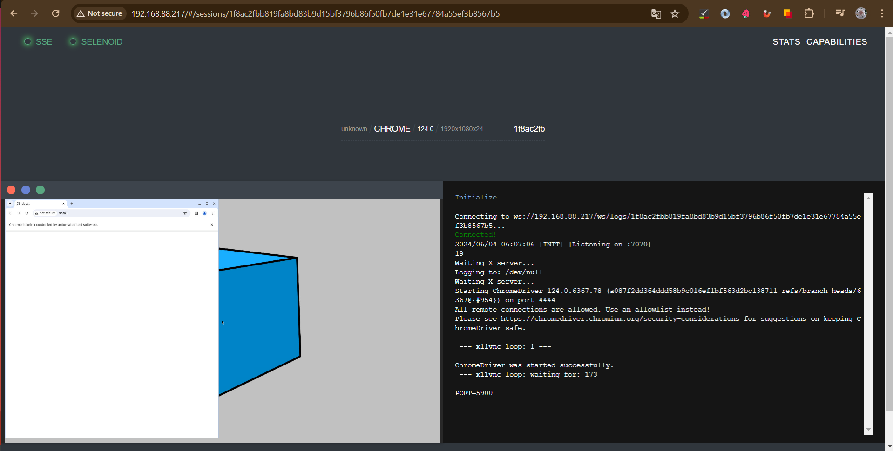

# Разворачивание и подключение Selenoid

Этот репозиторий содержит все необходимые конфигурационные файлы и скрипты для настройки и запуска **Selenoid** и связанных
сервисов с использованием **Docker** и **Docker Compose**.

## Структура проекта
<p align="center">
      
</p>

## Файлы и директории
**docker-compose.yaml**: Файл конфигурации `Docker Compose` для запуска `Selenoid`, `GGR`, `Selenoid UI`, `GGR UI` и `Nginx`.   
**browsers.json**: Файл конфигурации браузеров для `Selenoid`.  
**nginx.conf**: Конфигурационный файл для `Nginx`, настроенный для проксирования запросов к `Selenoid` и `GGR`.  
**quota.xml**: Файл конфигурации квот для `GGR`, определяющий доступные браузеры и их версии.   
**selenoid.sh**: Скрипт для обновления конфигурационных файлов и запуска `Selenoid` и связанных сервисов.
Скрипт автоматически обновляет конфигурационные файлы и создает файл `.env` с необходимыми переменными 
окружения для `Docker Compose`.

## Настройка и запуск
Убедитесь, что у вас установлены `Docker` и `Docker Compose`. Используйте скрипт `selenoid.sh` для автоматического 
обновления необходимых переменных.

<p align="center">
      
</p>

Запустите скрипт с указанием названия браузера и версии: 

```bash
./selenoid.sh <browser_name> <browser_version>
```
Например:

```bash
./selenoid.sh chrome 124.0
```
Скрипт обновит конфигурационные файлы и запустит все сервисы с помощью `Docker Compose`.

## Остановка сервисов
Для остановки всех запущенных сервисов используйте команду:

```bash
cd <SELENOID_DIR>
docker-compose down
```

## Пример запуска контейнеров в терминале и запуска `Selenoid` в браузере
<p align="center">
    
    
    
</p>
